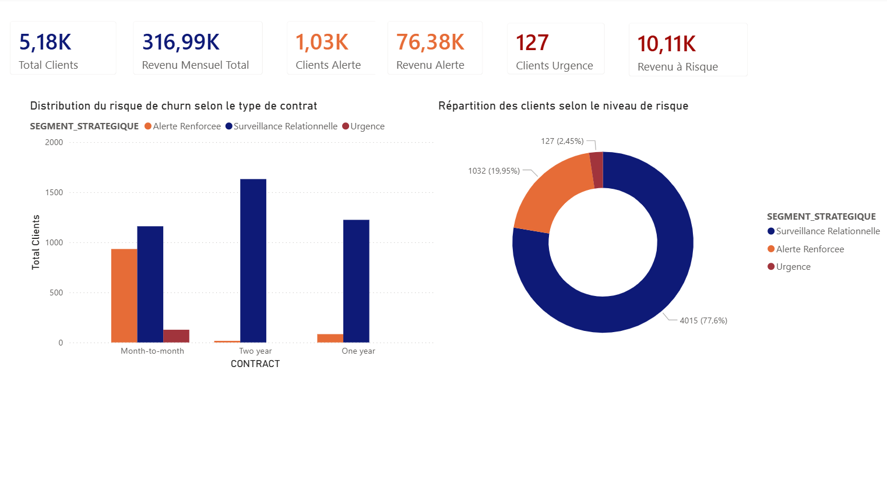

#  Analyse du Churn Client – Télécommunications

##  Présentation du Projet
Ce projet analyse le phénomène de churn client (résiliation d’abonnement) dans le secteur des télécommunications.
L'objectif est de :
* identifier les facteurs expliquant le départ des clients
* construire un score de risque churn
* segmenter les clients selon leur niveau de risque
* produire un dashboard décisionnel
* développer une application interactive d'exploration des données

Le dataset provient du dataset **IBM Telco Customer Churn**.
Caractéristiques :
* 7043 clients
* données démographiques
* services souscrits
* contrats et facturation
* statut churn

##   Technologies utilisées
* **Base de données** : Oracle SQL (SQLPlus, SQLLoader)
* **Langages** : SQL, DAX, Python
* **Business Intelligence** : Power BI
* **Application Data** : Streamlit
* **Versionnement** : Git, GitHub

##  Pipeline Data
Le projet suit une pipeline complète permettant de transformer des données brutes en outil d'aide à la décision.

```text
Dataset CSV
      │
      ▼
Import Oracle SQL
(SQL Loader)
      │
      ▼
Nettoyage et préparation
(SQL)
      │
      ▼
Analyse exploratoire
(SQL)
      │
      ▼
Analyse des facteurs de churn
(SQL)
      │
      ▼
Segmentation des clients
(score de risque)
      │
      ├────────► Dashboard Power BI
      │
      ▼
Application interactive Streamlit
```

## Structure du projet

```
Portfolio-Analyse-Churn
│
├── README.md
├── churn_data.csv
├── app.py
├── requirements.txt
│
├── sql
│   ├── 01_data_ingestion.sql
│   ├── 02_data_cleaning.sql
│   ├── 03_exploratory_analysis.sql
│   ├── 04_churn_analysis.sql
│   ├── 05_segmentation.sql
│   └── load_data.ctl
│
└── powerbi
    ├── powerbi_churn.pbix
    ├── dax_measures.md
    └── capturepowerbi.png
```

##  Partie SQL
Le dossier `sql/` contient l’ensemble du pipeline analytique.

### 1️⃣ Ingestion des données
* **Fichier** : `01_data_ingestion.sql`
* **Description** : Création de la table clients et préparation de la structure pour l’import.
* **Import** : Dataset importé via `load_data.ctl` avec l'utilitaire SQL Loader.

### 2️⃣ Nettoyage des données
* **Fichier** : `02_data_cleaning.sql`
* **Actions réalisées** :
    * Gestion des valeurs nulles.
    * Conversion de `TotalCharges` en format numérique.
    * Vérification de l’intégrité des données.
    * Création de la clé primaire.

### 3️⃣ Analyse exploratoire
* **Fichier** : `03_exploratory_analysis.sql`
* **Analyse univariée** : Étude du genre, senior citizen, partner, dependents, services souscrits, contrat, et méthode de paiement.
* **Analyse quantitative** : Étude de l'ancienneté client, de la facture mensuelle et de la valeur client.

### 4️⃣ Analyse du churn
* **Fichier** : `04_churn_analysis.sql`
* **Description** : Analyse bivariée entre chaque variable et la variable churn afin d’identifier les facteurs associés aux départs clients.

### 5️⃣ Segmentation des clients
* **Fichier** : `05_segmentation.sql`
* **Description** : Construction d’un score de risque churn basé sur des facteurs clés (contrat mensuel, faible ancienneté, absence de support/sécurité, fibre optique, etc.).
* **Segmentation finale** :

| Score | Segment |
| :--- | :--- |
| 10 – 12 | 🔴 Urgence |
| 7 – 9 | 🟠 Alerte |
| ≤ 6 | 🟢 Surveillance |

---

##  Dashboard Power BI
Le dossier `powerbi/` contient le tableau de bord décisionnel.
* **Fichier principal** : `powerbi_churn.pbix`
* **Indicateurs clés** : Nombre total de clients, revenu mensuel, score moyen de risque, clients à risque élevé, revenu exposé au churn.
* **Logique DAX** : Détails disponibles dans `dax_measures.md`.
* **Aperçu du dashboard** :


---

##  Application Interactive
Une application web a été développée avec **Streamlit**.
* **Fichier** : `app.py`
* **Fonctionnalités** : Exploration des données, visualisation des variables, segmentation dynamique et recommandations de fidélisation.
* **Déploiement** : [https://customer-churn-dashboards.streamlit.app](https://customer-churn-dashboards.streamlit.app)

---

##  Principaux résultats de l’analyse
* **Contrat mensuel** : Les clients avec contrat *Month-to-month* présentent un taux de churn de **42,7 %** (contre 11,3 % pour 1 an et 2,8 % pour 2 ans).
* **Fibre optique** : Taux de churn élevé (**~41 %**), suggérant un possible problème de satisfaction sur ce service.
* **Mode de paiement** : Le chèque électronique présente un risque plus élevé que les paiements automatiques.
* **Impact financier** : Les clients sortants ont une facture moyenne plus élevée, rendant leur rétention critique pour le chiffre d'affaires.

---

## 🔄 Actions de fidélisation proposées

L’analyse du churn et la segmentation des clients à risque permettent d’identifier plusieurs leviers d’action pour améliorer la rétention client.

### 🔴 Clients à risque élevé (Score ≥ 10)

1. **Conversion des contrats mensuels**  
Encourager les clients avec contrat *Month-to-month* à passer vers un contrat **annuel** ou **biannuel** afin de réduire la probabilité de résiliation.

2. **Audit technique pour les clients Fibre Optique**  
Mettre en place un diagnostic technique ou une assistance proactive pour améliorer la qualité perçue du service internet.

3. **Promotion des paiements automatiques**  
Inciter les clients utilisant **Electronic Check** à adopter les paiements automatiques (carte ou prélèvement bancaire), ce qui réduit les frictions liées au paiement.

4. **Programme d’accompagnement des nouveaux clients**  
Mettre en place un suivi client durant les premiers mois d’abonnement (période où le risque de churn est le plus élevé).

---

### 🟠 Clients à risque modéré (Score 7 – 9)

5. **Offre de support technique prioritaire**  
Inclure une assistance technique premium afin de réduire la frustration liée aux problèmes techniques.

6. **Pack sécurité et protection des appareils**  
Proposer des services de sécurité (antivirus, protection réseau, sauvegarde cloud) afin d’augmenter la valeur perçue de l’offre.

7. **Amélioration de la communication client**  
Envoyer des factures et communications pédagogiques expliquant les services consommés et les avantages de l’offre.

8. **Services additionnels (cloud / stockage)**  
Proposer des services complémentaires pour renforcer l’attachement à l’écosystème de l’opérateur.

---

### 🟢 Clients sous surveillance (Score ≤ 6)

9. **Accompagnement spécifique pour les clients seniors**  
Proposer une assistance adaptée aux utilisateurs moins familiers avec les outils numériques.

10. **Offres multi-lignes ou familiales**  
Encourager l’ajout de lignes supplémentaires afin d’augmenter la dépendance au service.

11. **Pack Divertissement**
Proposer un service de streaming à tarif réduit pour augmenter la valeur perçue de l’offre et fidéliser les clients.

##  Contact

Pour toute question concernant ce projet ou pour discuter d'opportunités en  Data Science :

- LinkedIn : www.linkedin.com/in/ben-enfaneassoumani
- Email : benenfane.assoumani@gmail.com